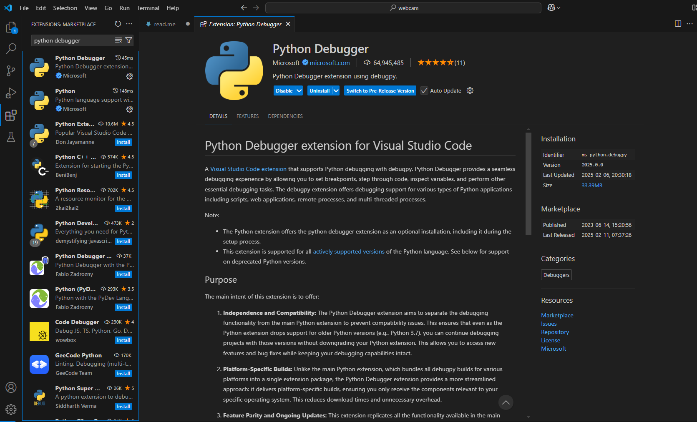
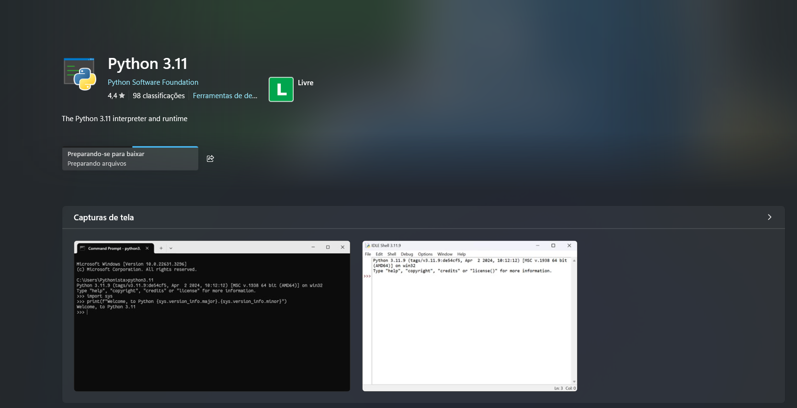
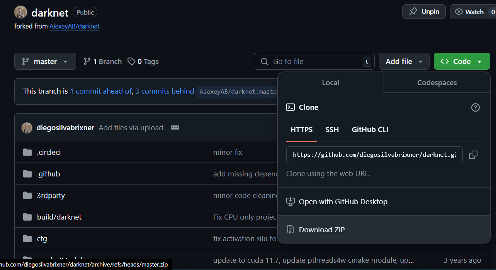
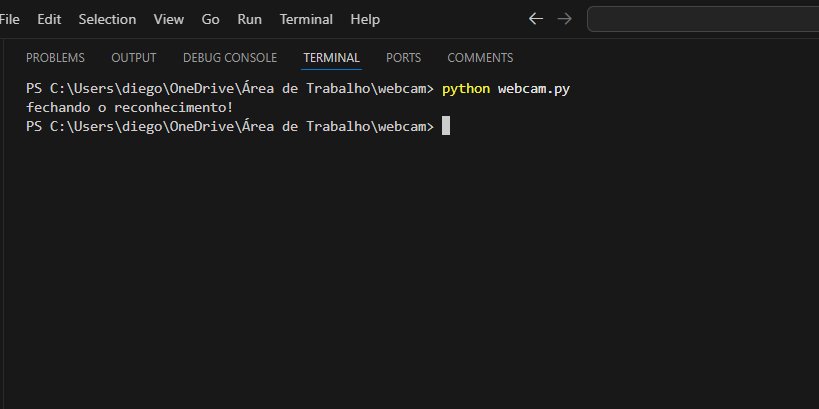
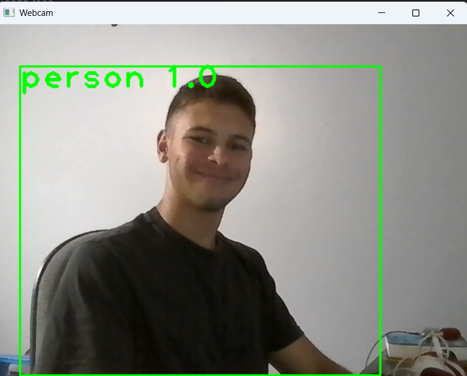
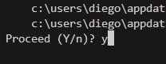
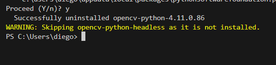

# PROJETO ESCOLAR.

### Foi proposto em aula o seguinte cenário. 
#### " Introdução
A segurança da informação é um campo essencial que envolve a proteção de dados contra acessos não autorizados, uso indevido, divulgação, destruição, modificação ou interrupção. Neste estudo de caso, exploraremos a implementação de controles de acesso em uma escola de ensino médio fictícia chamada "Escola Kakaroto Z" para proteger informações sensíveis de alunos, professores e funcionários.

#### Contexto
A Escola Kakaroto Z é uma instituição que possui aproximadamente 800 alunos, 50 professores e 30 funcionários administrativos. A escola utiliza um sistema de gestão educacional (SGE) para armazenar e gerenciar informações acadêmicas e administrativas, incluindo notas dos alunos, informações de contato, horários de aulas e registros de presença.

#### Problema
Recentemente, a escola enfrentou um incidente de segurança onde um aluno conseguiu acessar informações confidenciais do SGE usando as credenciais de um professor. Esse incidente destacou a necessidade de implementar controles de acesso mais rigorosos para proteger os dados armazenados no sistema.

#### Objetivo

O objetivo deste estudo de caso é analisar os controles de acesso existentes na Escola Kakaroto Z, identificar vulnerabilidades e propor melhorias para fortalecer a segurança da informação.

#### Considerar
* Análise dos Controles de Acesso Existentes;
* Proposta de Melhorias;
* Implementação das Melhorias; "

# SOLUÇÕES ENCONTRADAS:

* Instalar um sistema de câmeras de alta definição em cada sala da escola.
* Desenvolver um sistema que permitisse facil acesso a estas câmeras (se trata do projeto Cameras.py do meu repositorio).
* Criar um método para que mantivesse a segurança dos dados mesmo considerando as possiveis falhas humanas. 

E esta aplicação se refere a última solução da lista.

Utilizando tecnologia de detecção de movimento e presença com YOLO, foi possível desenvolver um sistema capaz de fechar automaticamente o programa que estiver em execução assim que o professor não estiver mais presente em frente à webcam do computador.  
Atualmente, a aplicação apenas fecha o próprio programa, permanecendo ativa para qualquer pessoa que esteja em frente à webcam. Ainda não foi configurada para identificar usuários autorizados, pois o solicitado era apenas apresentar a ideia da solução e um pequeno esboço de implementação. Mesmo com pontos a serem aprimorados, o projeto cumpriu seu propósito dentro do tempo disponível para desenvolvimento.

# COMO TESTAR?

#### Para testar a nossa aplicação é simples, você só precisará seguir alguns passos.

### ⚠️É NECESSESSÁRIO TER UMA WEBCAM PARA PODER TESTAR!

#### Este método vale para rodar o programa a partir do visual estudio code.

## 1. Instalar um depurador (debugger) Python. 
É necessário instalar a extensão do debbuger pelo VScode.

E também pela microsoft store caso esteja usando o windows.

## 2. Baixar o repositório no GitHub.
Basta clicar no botão verde escrito <>Code e depois ir em download ZIP.

## 3. Abrir os arquivos no VS Code e instalar as bibliotecas necessárias.  
No terminal do VS Code, cole os seguintes comandos, um por vez:
* "pip install opencv-python numpy"  
#### Se você tem GPU NVIDIA, instale também o OpenCV com CUDA para melhor desempenho:
* "pip install opencv-python-headless"

## 4. Rodando o código!!
Após seguir todos os passos, você pode agora abrir o terminal e digitar o seguinte comando.
* "python webcam.py"

Se tudo estiver correto, você verá uma interface com a webcam aberta, semelhante à imagem abaixo.
Para fechar o programa, basta sair da frente da webcam ou pressionar a tecla "Q".

## 5. Não rodou, e agora?
Se o programa não rodar mesmo seguindo todos os passos corretamente, pode ser um problema com a versão da biblioteca OpenCV.

#### Primeiro vamos verificar a versão do OpenCV instalada em sua maquina.  
* python -c "import cv2; print(cv2.__version__)"  
Se mostrar algo como "4.x.x-headless", significa que você está com a versão errada.

#### Agora vamos desinstalar o OpenCV atual.
* pip uninstall opencv-python opencv-python-headless  

  
Aqui ele perguntará se você quer proceder, basta digitar "Y" minúsculo ou maiúsculo e apertar a tecla Enter.  
  
Feito isso esta mensagem deve aparecer no seu terminal.

#### Agora vamos instalar a versão correta do OpenCV
Basta colar este comando no seu terminal e apertar a tecla Enter.
* pip install opencv-python  

Se você tem GPU NVIDIA, instale também o OpenCV com CUDA para melhor desempenho:
* pip install opencv-contrib-python

### 🚀 Agora você esta pronto para rodar o programa novamente!!
Execute:
* python webcam.py  

E veja a mágica acontecer! 🎩✨

